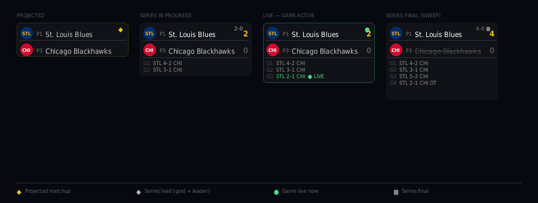

# 🏒🏀 NHL + NBA Playoffs Wallpaper Generator

A single-file browser app that generates a live, updating desktop wallpaper showing the full 2026 NHL Stanley Cup Playoffs and NBA Playoffs brackets — complete with team logos, series scores, per-game results, and automatic winner progression.

---

## Features

- **Full bracket layout** — West on the left, East on the right; Round 1 → Round 2 → Conference Finals → Championship, with the Finals card centered and 30% larger than all other cards
- **Live scores via ESPN** — pulls real series wins and per-game scores directly from ESPN's public API (no API key required)
- **Auto winner promotion** — when a team wins a series, they automatically advance into the correct next-round slot
- **Per-game score log** — each series card shows a compact two-column game-by-game breakdown with the winning team highlighted in each game
- **Inline win counts** — win counts appear beside each team name as soon as the matchup is confirmed, starting at 0–0; increments as games are won; turns gold on the clinching team at 4 wins; completed series cards dim automatically so active series stand out
- **NBA play-in aware** — seeds 7 and 8 are automatically resolved from play-in results once the tournament concludes
- **NHL division-based bracket** — correct R1 format: division winner vs wild card, 2nd vs 3rd within each division
- **Future round context** — TBD slots in Round 2 and Conference Finals show the seed that will advance (e.g. "Seed W1") before teams are determined
- **Dynamic season detection** — page title and bracket headers update automatically each season; no file edits needed year to year
- **Team logos** — all 30+ teams rendered using ESPN's CDN logo URLs
- **Smart export** — detects your primary monitor's resolution and OS at download time:
  - Exports a JPEG at your screen's exact native resolution
  - **Windows/Linux**: reserves 48px at the bottom for the taskbar
  - **macOS**: reserves menu bar height at the top (scales with Retina/HiDPI)
- **No scrollbars** — the bracket scales to fill 90% of your browser window, centered, with no overflow

---

## Live app

**[Open the wallpaper generator](https://tcstar.github.io/NHL_NBA_Wallpaper_Generator/playoffs-wallpaper-2026.html)** — no download or install required. Works in any modern browser.

---

## Usage

1. Open the link above in your browser
2. Click **↻ Update** — the bracket loads automatically with the active season data from ESPN
3. Click **⬇ Download JPEG** — exports at your screen's native resolution (label shows detected size)
4. Set the downloaded JPEG as your desktop wallpaper using **Fill** mode

> **Tip:** Click Update each morning during the playoffs to refresh scores. Winners automatically advance through the bracket as series are decided.

### Running locally (optional)

If you prefer to run the file locally rather than via the hosted link, browsers block API requests from `file://` pages, so you need a local web server:

**Mac / Linux:**
```bash
cd ~/Downloads          # or wherever you saved the file
python3 -m http.server 8000
```

**Windows (Command Prompt):**
```cmd
cd %USERPROFILE%\Downloads
python -m http.server 8000
```

Then open **http://localhost:8000** in your browser and click the file name. Stop the server with `Ctrl+C` when done.

---

## Wallpaper Settings

| Monitor | Recommended fit mode |
|---|---|
| 2560×1440 (primary) | Fill |
| 1920×1200 (laptop) | Fill |
| Any 16:9 monitor | Fill |
| 16:10 monitor | Fill (slight crop) or Fit (small bars) |

**Windows:** Right-click desktop → Personalize → Background → set each monitor to **Fill** individually by right-clicking each thumbnail.

**macOS:** System Settings → Wallpaper → set to **Fill Screen**.

---

## How It Works

The file is entirely self-contained HTML/CSS/JS with no build step or dependencies beyond two CDN scripts loaded at runtime:

- **[html2canvas](https://html2canvas.hertzen.com/)** — renders the bracket DOM to a canvas for JPEG export
- **[Barlow / Barlow Condensed](https://fonts.google.com/specimen/Barlow)** — typography (loaded from Google Fonts)

Score updates call ESPN's unofficial public API. Two endpoints are used per league:

- **Playoff games** — `site.api.espn.com/apis/site/v2/sports/{sport}/{league}/scoreboard?seasontype=3&dates=YYYYMMDD-YYYYMMDD` fetches all games from April 1 through today, ensuring the full game-by-game history for every active series is available, not just today's scheduled games
- **Standings** — `site.web.api.espn.com/apis/v2/sports/{sport}/{league}/standings?level=3` returns the full conference → division → team hierarchy used to build projected brackets

Both endpoints are open, require no authentication, and work directly from the browser when served over HTTP.

The app always builds the bracket from standings first (ensuring correct seed order and conference placement), then overlays live game scores on top. This means all 8 R1 series appear correctly from Day 1 of the playoffs even if not all series have started yet.

Round numbers are read from each game's `competition.type.abbreviation` field, which ESPN populates consistently for both NHL and NBA: `RD16` = Round 1, `QTR` = Round 2, `SEMI` = Conference Finals, `FINAL` = Championship. Note that the `series.type` field in ESPN's current API returns a plain string (`"playoff"`) rather than a structured object and is not used for round detection.

Each time you click **Update**, the playoff scoreboard is fetched for the full date range from April 1 through today — this is what populates the per-game score log for every completed game in each series. Scores do not update automatically; clicking Update is required to refresh results. Both leagues are fetched in parallel, so the full update completes in roughly the time of a single request rather than two sequential ones.

---

## Bracket Structure

```
NHL (top half)                NBA (bottom half)
  Left:  Western Conference    Left:  Western Conference
  Right: Eastern Conference    Right: Eastern Conference
```

Each half flows left to right:

```
West R1 → West R2 → West CF → [Championship] ← East CF ← East R2 ← East R1
```

NHL R1 uses the division-based format: best division winner vs WC2, 2nd vs 3rd within that division, other division winner vs WC1, and 2nd vs 3rd within that division. The best division winner (most points) appears at the top of the bracket.

NBA R1 uses seeds 1–8 per conference. Seeds 7 and 8 are determined by the play-in tournament and are resolved automatically once those results are available — the R1 card shows the play-in placeholder until ESPN confirms the winner, then updates in place. The bracket follows the standard NBA display order — 1 seed at top, 4v5 second, 3v6 third, 2 seed at bottom — so the 1 and 2 seeds converge at the Conference Finals rather than meeting earlier.

---

## Series card states

Each matchup card shows one of four states. The icon in the top-right corner matches the legend in the bottom-right of the wallpaper.

| Icon | State | What you see |
|---|---|---|
| ◆ | Projected | Matchup based on current standings — playoffs haven't started yet |
| (no icon) | Series in progress | Win counts shown from the moment both teams are confirmed, starting at 0–0; leading team highlighted in white; clinching team's count turns gold at 4 wins; game log shows results two per row with the winning team bold |
| ● | Live | A game is currently in progress; live score shown in green |
| ■ | Final | Series over; eliminated team crossed out; card dimmed; full game log with per-game winner highlighted |

Game scores in the log use ESPN's official team abbreviations (e.g. `OKC`, `ORL`, `SA`) rather than auto-generated initials.



---

## Updating for future seasons

Team matchups are fetched dynamically from ESPN's API each time you click **Update** — no code changes are needed from season to season. The app detects the active season automatically:

- **Regular season** → shows projected bracket based on current standings
- **Playoffs active** → switches to live bracket with real series wins and game scores
- **Offseason** → shows a placeholder until the new season begins

---

## License

MIT — do whatever you want with it.
